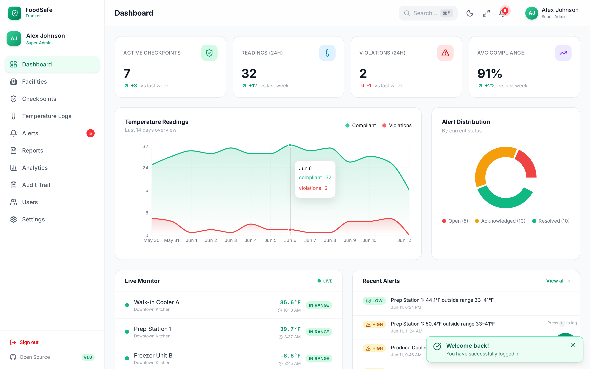
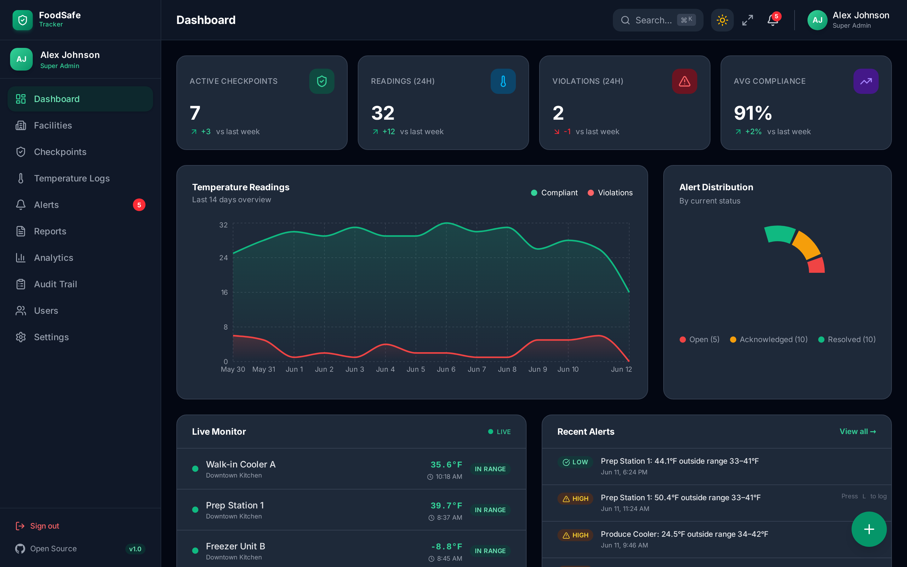
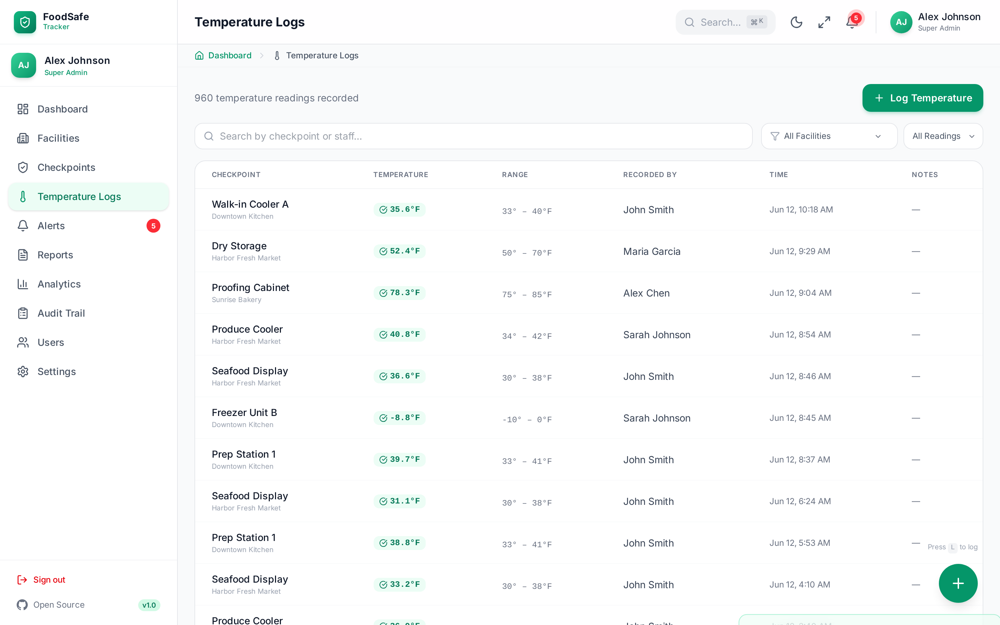
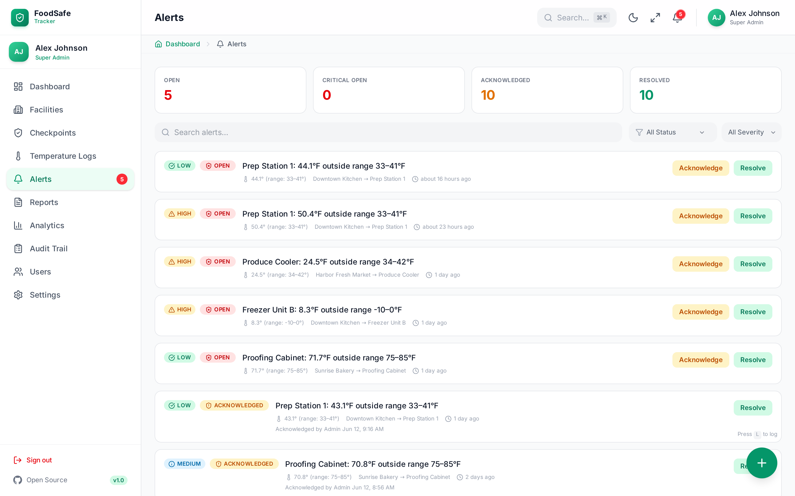
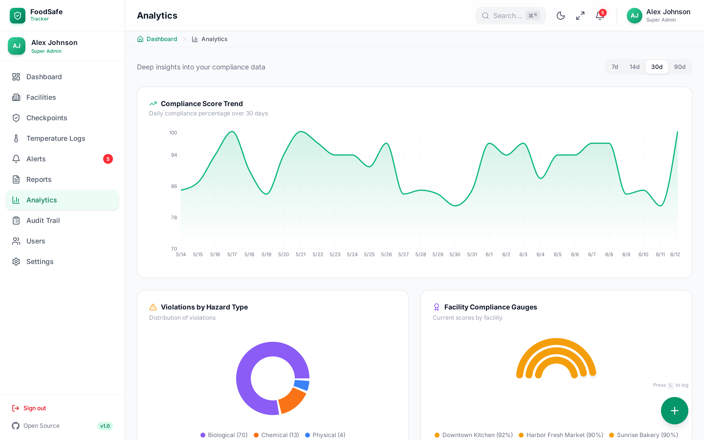
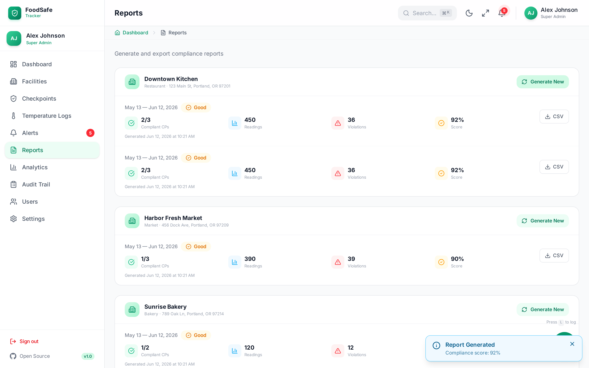
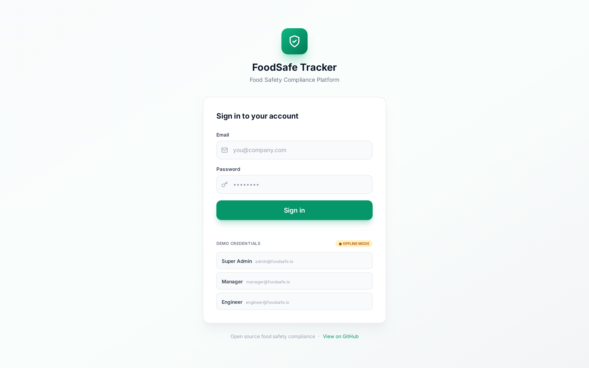

# 🛡️ FoodSafe Tracker

**Open Source Food Safety Compliance Platform**

A comprehensive, production-ready food safety management system built for small-to-medium food businesses. Track safety checkpoints, log temperature readings, manage compliance reports, and maintain audit trails — all without drowning in paperwork.


**🌐 [Live Demo](https://mahimmazidul.github.io/FoodSafe-Tracker/)** — runs entirely in your browser (offline demo mode, no backend needed). Log in with `admin@foodsafe.io` / `admin123`.

---

## 📸 Preview

### Dashboard


### Dark Mode


<details>
<summary><b>More screenshots</b> — Temperature Logs, Alerts, Analytics, Reports, Login</summary>

### Temperature Logs


### Alerts


### Analytics


### Reports


### Login


</details>

---

## ✨ Features

### Core Functionality
- **Temperature Logging** — Quick-entry temperature readings with preset values and instant compliance feedback
- **Checkpoint Management** — Configure monitoring points with hazard types, temperature ranges, and frequencies
- **Real-time Alerts** — Automatic violation detection with severity classification (Critical/High/Medium/Low)
- **Compliance Reports** — Generate and export CSV reports with compliance scores and violation summaries
- **Analytics Dashboard** — Visualize trends, heatmaps, staff performance, and facility rankings
- **Audit Trail** — Complete accountability with who-did-what-when tracking

### Access Control
- **Multi-User Authentication** — Secure login system with session management
- **Role-Based Permissions** — Three access levels:
  - **Super Admin** — Full system access, user management, all facilities
  - **Manager** — Facility oversight, reports, alert management
  - **Engineer** — Temperature logging, checkpoint monitoring, limited access

### User Experience
- **Dark/Light Mode** — System-aware with manual toggle, persisted preference
- **Responsive Design** — Full mobile support with touch-optimized interfaces
- **Smooth Animations** — Framer Motion transitions, skeleton loading states
- **Toast Notifications** — Real-time feedback for all actions
- **Keyboard Navigation** — Accessible with full keyboard support

---

## 🚀 Quick Start

### Prerequisites
- Node.js 18+ 
- npm 9+ or yarn 1.22+

### Installation

```bash
# Clone the repository
git clone https://github.com/mahimmazidul/FoodSafe-Tracker.git
cd FoodSafe-Tracker

# Install dependencies
npm install

# Start development server
npm run dev
```

Open [http://localhost:5173](http://localhost:5173) in your browser.

### Demo Credentials

| Role | Email | Password |
|------|-------|----------|
| Super Admin | admin@foodsafe.io | admin123 |
| Manager | manager@foodsafe.io | manager123 |
| Engineer | engineer@foodsafe.io | engineer123 |

---

## 🏗️ Project Structure

```
foodsafe-tracker/
├── src/
│   ├── components/       # Reusable UI components
│   │   ├── Badge.tsx        # Status, severity, compliance badges
│   │   ├── Header.tsx       # Top navigation bar
│   │   ├── Sidebar.tsx      # Main navigation
│   │   ├── Skeleton.tsx     # Loading states
│   │   ├── Toast.tsx        # Notification system
│   │   ├── Select.tsx       # Custom dropdown
│   │   └── Icons.tsx        # SVG icon components
│   ├── pages/            # Route components
│   │   ├── Login.tsx        # Authentication
│   │   ├── Dashboard.tsx    # Main overview
│   │   ├── Facilities.tsx   # Location management
│   │   ├── Checkpoints.tsx  # Monitoring points
│   │   ├── Temperature.tsx  # Reading logs
│   │   ├── Alerts.tsx       # Violation management
│   │   ├── Reports.tsx      # Compliance reports
│   │   ├── Analytics.tsx    # Data visualization
│   │   ├── AuditTrail.tsx   # Activity log
│   │   ├── Users.tsx        # User management
│   │   └── Settings.tsx     # Preferences
│   ├── store/            # State management
│   │   ├── index.ts         # Zustand store
│   │   ├── types.ts         # TypeScript definitions
│   │   └── seed.ts          # Demo data
│   └── utils/            # Helper functions
│       └── cn.ts            # Class name utility
├── public/               # Static assets
├── index.html            # Entry HTML
├── package.json          # Dependencies
├── vite.config.ts        # Build config
├── tsconfig.json         # TypeScript config
└── README.md             # Documentation
```

---

## 🔧 Tech Stack

| Layer | Technology |
|-------|------------|
| Framework | React 19 + TypeScript |
| Build | Vite 7 |
| Styling | Tailwind CSS 4 |
| State | Zustand |
| Animations | Framer Motion |
| Charts | Recharts |
| Icons | Custom SVG Components |
| Date Utils | date-fns |

---

## 🔐 Role Permissions Matrix

| Feature | Engineer | Manager | Super Admin |
|---------|----------|---------|-------------|
| View Dashboard | ✅ | ✅ | ✅ |
| Log Temperature | ✅ | ✅ | ✅ |
| View Checkpoints | ✅ | ✅ | ✅ |
| Create Checkpoints | ❌ | ✅ | ✅ |
| Manage Facilities | ❌ | ✅ | ✅ |
| View Alerts | ✅ | ✅ | ✅ |
| Acknowledge Alerts | ✅ | ✅ | ✅ |
| Resolve Alerts | ❌ | ✅ | ✅ |
| Generate Reports | ❌ | ✅ | ✅ |
| View Analytics | ❌ | ✅ | ✅ |
| View Audit Trail | ❌ | ✅ | ✅ |
| Manage Users | ❌ | ❌ | ✅ |
| System Settings | ❌ | ❌ | ✅ |

---

## 📊 Backend API

A full REST backend lives in [`server/`](server/README.md) — Express + TypeScript + SQLite with JWT auth, role-based permissions, automatic alert creation, compliance report generation, CSV export, and an audit trail. It mirrors the frontend's data models in `src/store/types.ts` one-to-one.

**The frontend is fully wired to it.** On startup the app pings `VITE_API_URL/health`:

- ✅ **Backend running** → remote mode: JWT login, all data via the REST API, audit trail recorded server-side. A green "API CONNECTED" badge shows on the login page.
- 📴 **Backend unreachable** (or `VITE_ENABLE_DEMO_MODE=true`) → automatic fallback to the original offline demo mode (IndexedDB in the browser), with an amber "OFFLINE MODE" badge.

```bash
# Terminal 1 — backend
cd server && npm install && npm run dev    # http://localhost:3001

# Terminal 2 — frontend
npm install && npm run dev                 # http://localhost:5173
```

On first start it auto-seeds the **same demo data and credentials as the frontend** (`admin@foodsafe.io` / `admin123`, etc.), including 3 facilities, 8 checkpoints, and ~10 days of temperature history. For production, disable seeding and create your own account:

```bash
SEED_ON_START=false npm run dev
npm run create-admin -- --email you@company.com --password secret123 --name "Your Name"
```

```typescript
// Endpoint overview (all prefixed with /api, JWT-protected)
POST   /api/auth/login              // → { token, user }
POST   /api/auth/logout
GET    /api/auth/me
GET    /api/facilities              POST /api/facilities
GET    /api/checkpoints             POST /api/checkpoints
GET    /api/temperature-logs        POST /api/temperature-logs   // auto-creates alerts on violations
POST   /api/alerts/:id/acknowledge  POST /api/alerts/:id/resolve
GET    /api/reports                 POST /api/reports/generate
GET    /api/reports/:id/csv         // CSV export
GET    /api/audit
GET    /api/users                   POST /api/users              // superadmin only
GET    /api/analytics/summary       GET  /api/analytics/trends
```

See [server/README.md](server/README.md) for the full API reference, seed-data details, superadmin setup, and configuration.

---

## 🛠️ Development

### Available Scripts

```bash
# Development server with hot reload
npm run dev

# Production build
npm run build

# Preview production build
npm run preview

# Type checking
npx tsc --noEmit
```

### Environment Variables

Create a `.env.local` file for local development:

```env
VITE_API_URL=http://localhost:3001/api
VITE_APP_NAME=FoodSafe Tracker
```

---

## 🚢 Deployment

### Static Hosting (Vercel, Netlify, GitHub Pages)

```bash
npm run build
# Deploy the `dist/` folder
```

### Docker

```dockerfile
FROM node:18-alpine AS builder
WORKDIR /app
COPY package*.json ./
RUN npm ci
COPY . .
RUN npm run build

FROM nginx:alpine
COPY --from=builder /app/dist /usr/share/nginx/html
EXPOSE 80
CMD ["nginx", "-g", "daemon off;"]
```

---

## 🤝 Contributing

1. Fork the repository
2. Create a feature branch (`git checkout -b feature/amazing-feature`)
3. Commit changes (`git commit -m 'Add amazing feature'`)
4. Push to branch (`git push origin feature/amazing-feature`)
5. Open a Pull Request

---

## 📄 License

This project is licensed under the MIT License — see the [LICENSE](LICENSE) file for details.

---

## 🙏 Acknowledgments

- Built with [React](https://react.dev/)
- Styled with [Tailwind CSS](https://tailwindcss.com/)
- Charts by [Recharts](https://recharts.org/)
- Animations by [Framer Motion](https://www.framer.com/motion/)

---

**Made with ❤️ for food safety**
